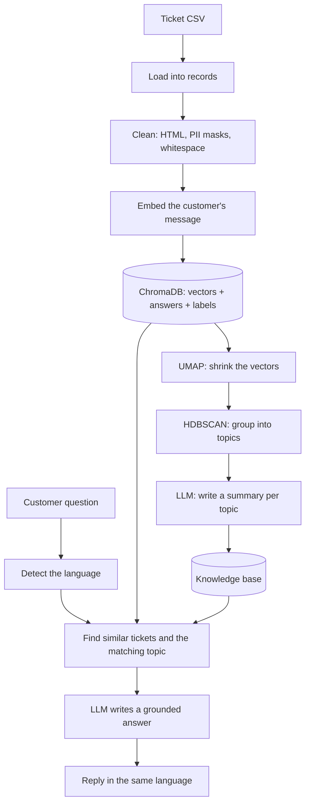

# Multilingual Customer Support Bot

A support bot that learns from a company's old support tickets and answers new customer questions, in the same language they were asked.

It takes a pile of past tickets, works out on its own what people usually have trouble with, and then uses that to answer new questions. It works across languages, so a question typed in English can pull up the fix from a German ticket when they are about the same thing. It doesn't invent answers. Everything it says comes from tickets it has actually seen.

> **Why I built this:** Every company sits on a heap of old support tickets, but that knowledge just rots in a spreadsheet nobody opens. The usual fix is to write an FAQ by hand, which is slow and goes stale fast. I wanted something that reads the raw tickets, figures out the common problems by itself, and answers new questions using how the old ones were handled. Nobody has to label or sort anything. The structure comes straight out of the data.

*Runs on Groq's `openai/gpt-oss-20b` for the writing, and a multilingual sentence-transformer for the search.*

<!-- Add a screenshot of a chat session here, e.g.  -->

---

## How it works



1. **Load the tickets.** It reads the ticket CSV into simple records. Each one has the customer's message, the agent's reply, and a few labels like the queue and some tags.
2. **Clean them up.** Real tickets are messy. There are HTML line breaks, and the private info is masked in a dozen different ways (`<tel_num>`, `[Phone Number]`, `[Telefonnummer]`, and so on). The cleaner strips the HTML, turns all those masks into one standard form, and tidies the spacing.
3. **Turn each problem into a vector.** A multilingual model reads the customer's message and turns it into a list of numbers that captures the meaning. Messages that mean the same thing get similar numbers, even when they are in different languages. These go into ChromaDB along with the ticket's answer and labels.
4. **Find the topics on its own.** This is the part I care about most. It takes all the vectors, shrinks them down with UMAP, and groups them with HDBSCAN. Out comes a set of topics (login problems, billing issues, network drops, and so on) that nobody defined. The clustering found them in the data.
5. **Write a knowledge base.** For each topic it picks a handful of the most typical tickets and asks the LLM to write a short entry: what the problem is, the likely cause, and how it usually gets fixed. That becomes a small knowledge base built straight from the tickets.
6. **Answer a question.** When someone asks something, it first detects the language. Then it finds the most similar past tickets and the matching topic, hands both to the LLM as context, and the LLM writes an answer based only on that. The reply comes back in the language the person asked in.
7. **Stay in its lane.** If the question has nothing to do with support (while testing, someone asked it how to make eggs), it doesn't answer from general knowledge. It says it can only help with support questions.

---

## Key design decisions

These are the choices I made on purpose and can explain, which matters more than the code itself.

- **Embed the problem, not the answer.** When a customer asks something, I want to match it against past problems and then hand back the solutions. So the thing I turn into a vector is the customer's message, and the answer rides along as attached data. Putting the question and the answer into one vector would just blur the search.
- **Don't split tickets into chunks.** A long document gets chopped into pieces before it's embedded, but a ticket is one problem from one person. Splitting it would scatter a single issue across several vectors and break the clean link between a problem and its fix. So one ticket is one vector.
- **Shrink the vectors before clustering.** My first attempt ran HDBSCAN straight on the 768 number vectors and it basically ground to a halt. In that many dimensions everything looks equally far apart, so the grouping falls apart. Running UMAP first to bring it down to 5 numbers made it both fast and a lot better. I only added UMAP after I watched the simple version fail, so I actually understood why it was needed.
- **Match the masked info by keyword, not a giant list.** The private info was masked in dozens of spellings across two languages. Instead of listing every one, I look at the word inside the brackets. Anything with "tel", "phone", or "telefon" becomes one phone tag. That single rule handles the whole long tail.
- **Keep cleaning separate from loading.** The loader just reads the file into records. The cleaner does the HTML and masking work. Splitting them meant I could change one without touching the other.

---

## Tech stack

| Part | What I used |
|---|---|
| Language | Python |
| Embeddings | sentence-transformers, `paraphrase-multilingual-mpnet-base-v2` |
| Vector store | ChromaDB |
| Keyword search | rank-bm25 |
| Clustering | UMAP, HDBSCAN (scikit-learn) |
| LLM | Groq, `openai/gpt-oss-20b` |
| Answering loop | LangGraph |
| Data handling | pandas, numpy |
| Packaging and running | uv |

---

## Project structure

```
support-bot/
├── cli.py                      # commands: ingest-tickets, chat, inspect
├── ingestion/
│   ├── ticket_loader.py        # read the CSV into Ticket records
│   ├── cleaner.py              # strip HTML, fix PII masks, tidy whitespace
│   ├── embedder.py             # turn text into vectors (multilingual model)
│   ├── vector_store.py         # ChromaDB storage, hybrid search, MMR
│   ├── loader.py               # older document loader (PDF, DOCX, TXT)
│   └── chunker.py              # text splitter for the document path
├── rag/
│   ├── agent.py                # the answering loop (LangGraph)
│   ├── retriever.py            # pulls similar tickets and the topic together
│   └── knowledge_base.py       # matches a question to a discovered topic
├── clustering/
│   ├── cluster.py              # UMAP + HDBSCAN
│   ├── evaluate.py             # check the topics against the data's labels
│   ├── summarize.py            # LLM writes one knowledge base entry per topic
│   └── cluster_summaries.json  # the generated knowledge base
├── evaluation/
│   └── retrieval_eval.py       # compare vector vs keyword vs both
├── utils/
│   ├── language.py             # detect the question's language
│   └── prompts.py              # the LLM prompts
├── data/                       # the ticket CSVs (not committed)
├── pyproject.toml
└── uv.lock
```

---

## Getting started

### Prerequisites
- Python 3.11 or newer
- A [Groq API key](https://console.groq.com) (the free tier is fine)
- [`uv`](https://github.com/astral-sh/uv) for installing and running

### 1. Clone and install
```bash
git clone https://github.com/Aditya-G-22/support-bot.git
cd support-bot
uv sync
```

### 2. Add your key
Make a `.env` file (it is gitignored, so don't commit it):
```
GROQ_API_KEY=your_groq_key
```

### 3. Get the data
The tickets come from the [Customer IT Support dataset on Kaggle](https://www.kaggle.com/datasets/tobiasbueck/multilingual-customer-support-tickets). Download it and drop the CSV into a `data` folder.

### 4. Load the tickets
```bash
uv run python cli.py ingest-tickets --file data/dataset-tickets-multi-lang-4-20k.csv
```
This cleans and embeds all of them, which takes a while on a laptop. Add `--limit 2000` to try a smaller batch first.

### 5. Build the knowledge base
This groups the tickets into topics and writes a summary for each one:
```bash
uv run python -m clustering.summarize
```

### 6. Chat with it
```bash
uv run python cli.py chat
```
Ask something like `I can't log in after the latest update`. It pulls up similar tickets, shows you which topic it matched, and answers in your language.

---

## Evaluation

I didn't want to just trust that the clustering "looked right", so I checked it against the labels that came with the data, and I compared the search against two simpler versions. Both gave me real numbers to point at.

### Does the clustering find real topics?

The tickets came with tags (what the ticket is about) and a queue (which team it went to). I checked whether the topics the clustering found lined up with each.

| Checked against | Agreement |
|---|---|
| tags (what the ticket is about) | 85.1% |
| queue (which team handled it) | 39.5% |

The queue number looked bad at first, until I realized the queue is just routing, not what the ticket is about. The same problem can go to different teams. When I checked against the tags, which actually describe the content, the topics lined up 85% of the time. The one queue that is also a real topic, billing, matched 96%. So the low number was the wrong thing to compare against, not a broken result. That gap taught me more than a clean score would have.

### Does hybrid search beat plain vector search?

I compared three ways of finding similar tickets, scoring how often the top five results shared a tag with the question.

| Method | Score |
|---|---|
| Vector search only | 97.1% |
| Keyword search only (BM25) | 95.3% |
| Both together | 96.9% |

Adding keyword search on top of vector search didn't actually help here (96.9% is basically the same as 97.1%). So the hybrid setup isn't pulling its weight on this data. I kept it anyway, because it can still help for exact things like error codes that this test doesn't cover, but now I know the trade instead of guessing at it.

Run the checks yourself:
```bash
uv run python -m clustering.evaluate
uv run python -m evaluation.retrieval_eval
```

---

## Roadmap

- [x] Full ticket pipeline: load, clean, embed, store
- [x] Topic discovery with UMAP and HDBSCAN, checked against the labels
- [x] Knowledge base written by the LLM, one entry per topic
- [x] Answering with hybrid search and a topic match, grounded so it stays on topic
- [x] Search comparison (vector vs keyword vs both)
- [ ] Make it work on any company's data, not just this dataset
- [ ] Score the answers themselves, not just the search
- [ ] A proper multilingual test set with numbers behind it
- [ ] A simple web page instead of the terminal
- [ ] Logging and monitoring

---

## What I learned

This project taught me more about judgment than about any single library. The things that stuck:

- **What you measure against matters as much as the number itself.** My clustering scored 39% against one label and 85% against another, with nothing changed in between. The skill wasn't getting a high number. It was working out why the first one was low (it was the wrong label to compare to) and then checking against the right one.
- **Try the simple thing first and let it fail.** I ran the clustering without shrinking the vectors, and it stalled. Watching that happen taught me why dimensionality reduction matters far better than reading about it would have. Then I added UMAP and it worked.
- **The data has a ceiling, and the model shows you where it is.** When I had the LLM summarize each topic, the fixes all came out generic, things like "ask for more details and schedule a call". That wasn't the model being lazy. The agent replies in this dataset were mostly first responses, not real fixes, so there was nothing better to summarize. The couple of topics where the replies did have real content came out specific, which proved the model was being honest about the rest.
- **Cutting something is a real decision too.** I removed a whole knowledge graph after working out it didn't fit this kind of bot. Carrying code that does nothing is worse than deleting it, even if deleting feels like going backwards.
- **Measure before you keep complexity.** I had both vector and keyword search running and assumed the mix was better. When I actually measured it, the keyword part added nothing on this data. I have the evidence now instead of a guess, which was the whole point.
- **Know what your project can't do.** The data is synthetic, it only covers English and German, and long tickets get cut off by the model's length limit. None of that is hidden. Being able to say where the edges are is part of understanding what I built.

---

## Future scope

Right now it's a working bot that proves the idea end to end on one dataset. The next steps are about making it real:

- **Plug in any dataset.** The core (embed, store, search, cluster, answer) already works on any text. The part tied to this specific data is just the loader and the cleaning rules. Pulling those into a small config, where a company says which column is the problem and which is the answer, would turn this from a demo on one dataset into a tool any company could point at their own tickets.
- **Score the answers, not just the search.** I have measured how well it finds the right tickets. The next thing is judging the answers themselves, probably by having an LLM grade them against the tickets they were based on.
- **Prove the multilingual claim with numbers.** Cross language search clearly works in testing. I want a test set that puts a real number on it.
- **A simple interface.** A small web page where you upload tickets, watch them get processed, and ask questions would make it much easier to show.

---

## Contact

**Aditya Garg**
- adityagarg535@gmail.com
- [GitHub, @Aditya-G-22](https://github.com/Aditya-G-22)
